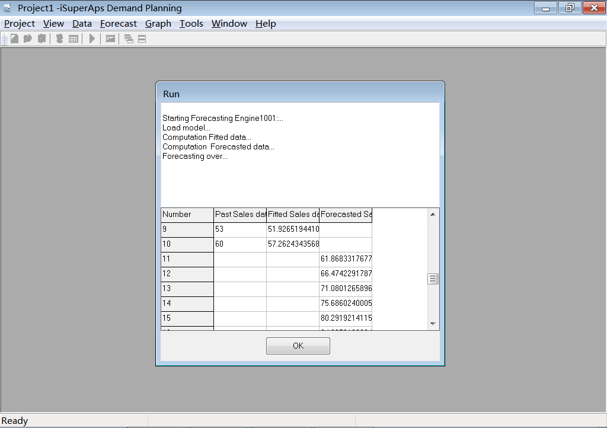
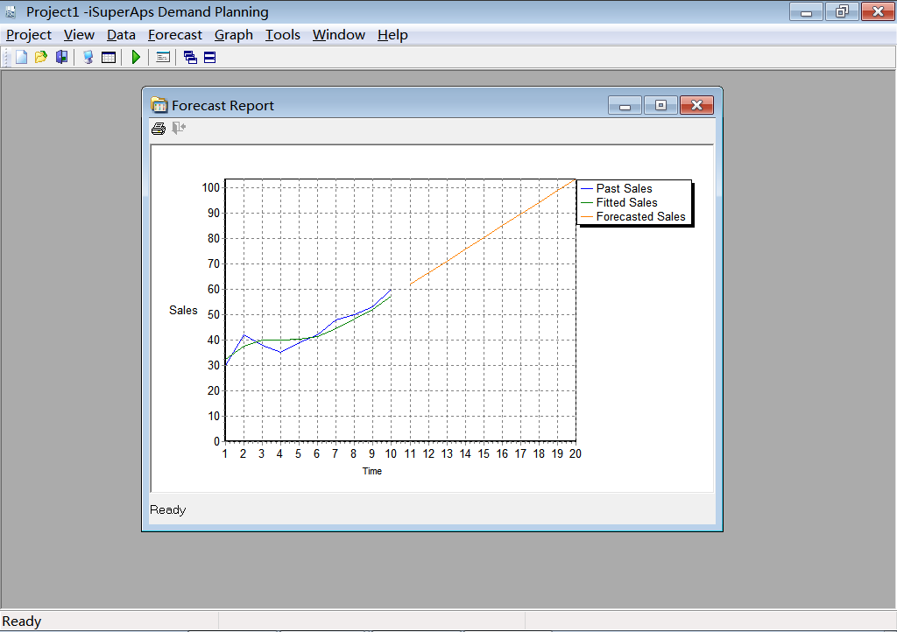
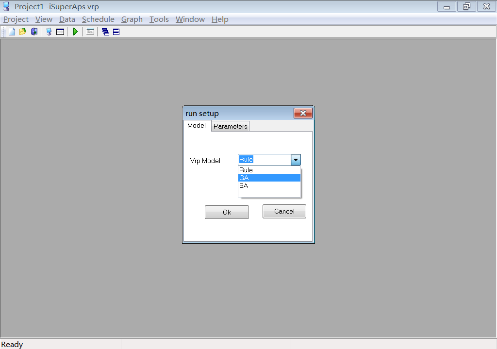
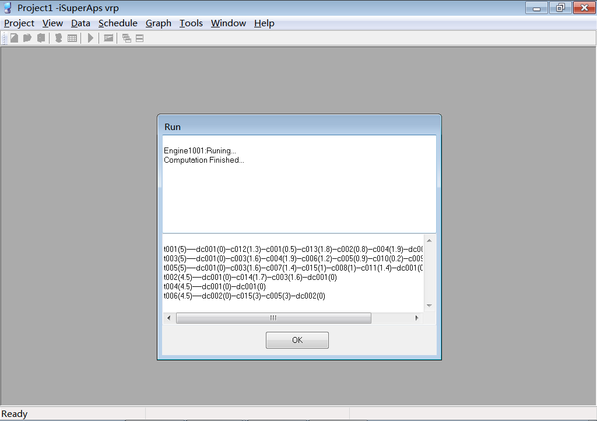
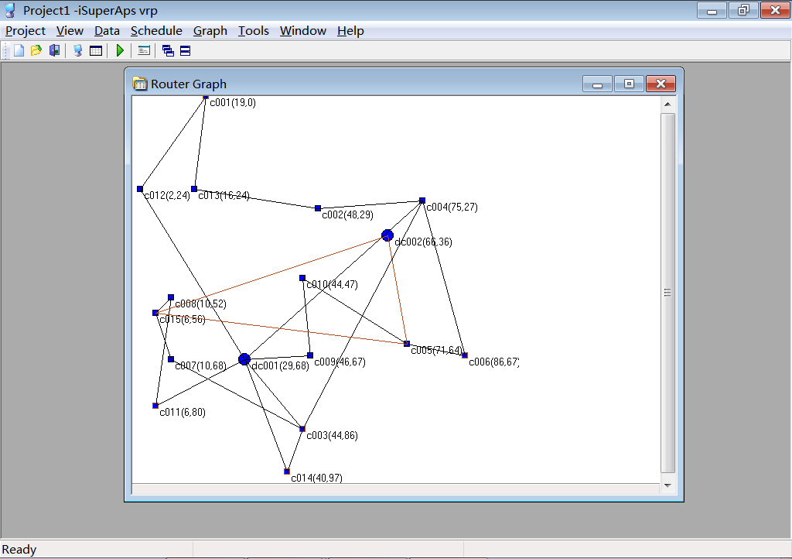
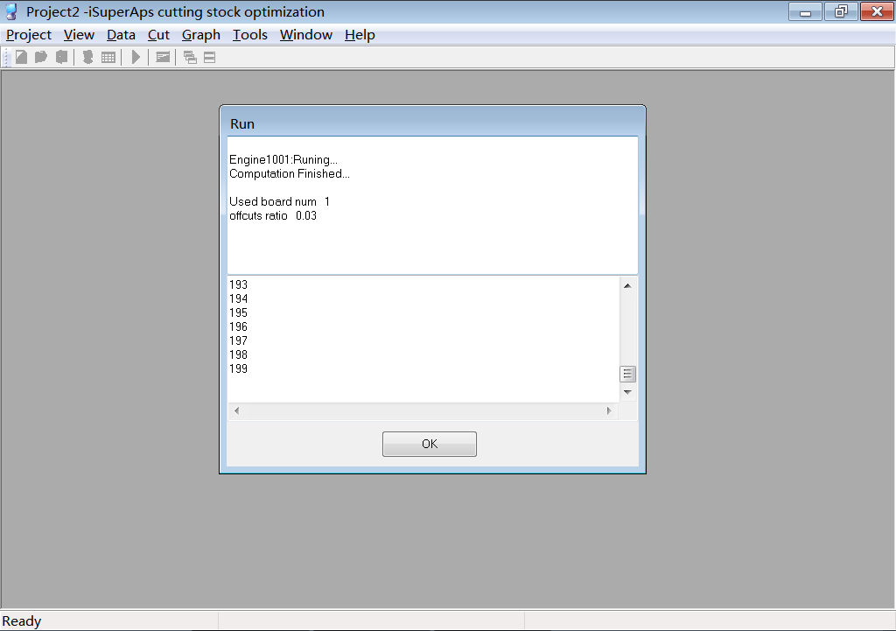
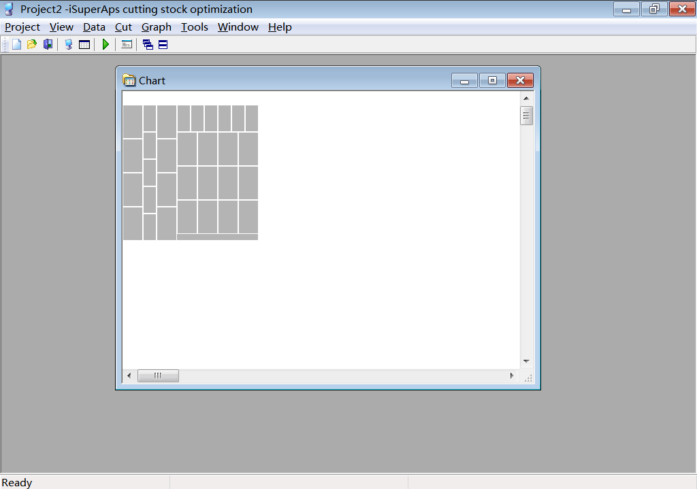
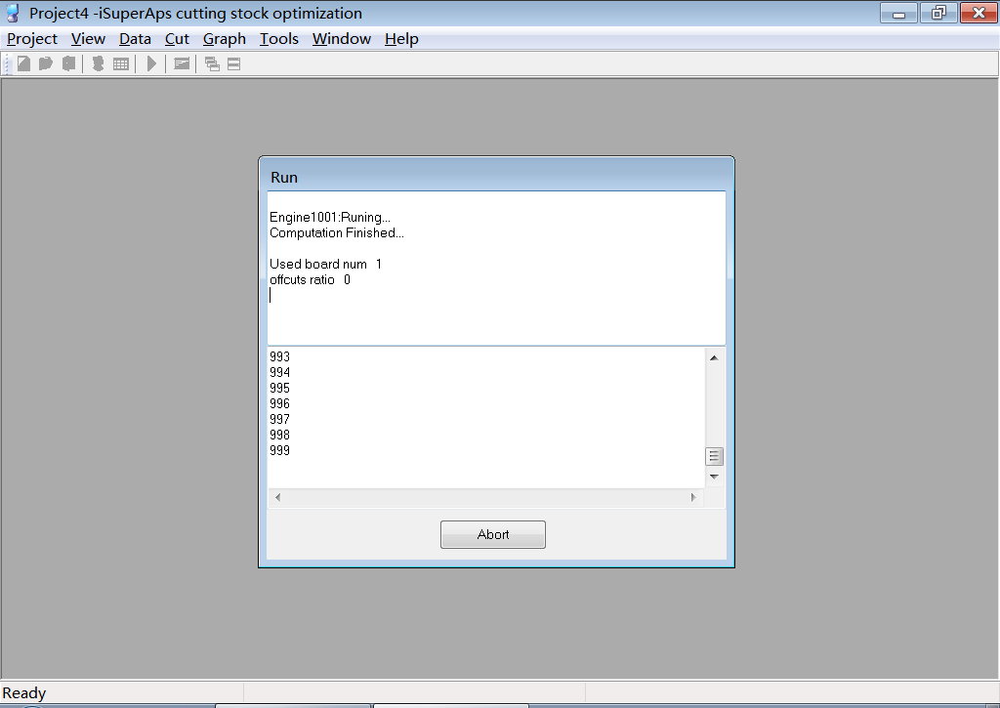

# OpenAPO
OpenAPO is a free APO（Advanced Planning and Optimizer） product ， provides more features than SAP APO

Including the following software:

1. demand forecast software free version (dp,size 8MB )

2. vehicle routing planning software free version(vrp,size 8MB )

3. Advanced Planning and Scheduling software free version(aps,size 32MB )

4. 2d cutting stock optimization software free version(cut,size 9MB )

5. supply chain network planning and design software open source free version(snp,size 12MB )

6. plant simulation/production logistics simulation software open source free version(sim,size 28MB )

7. Constraint Optimization Solver software open source free version(solver,size 12MB )

